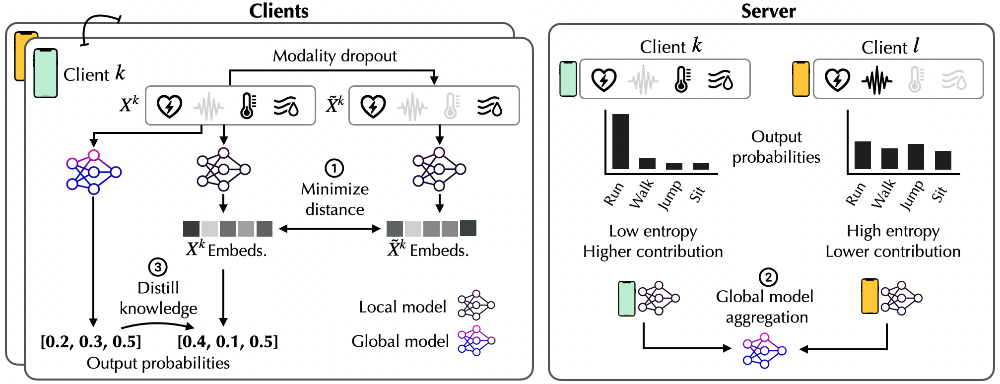

# FLISM: Federated Learning for Time-Series Healthcare Sensing with Incomplete Modalities


## Paper


[FLISM: Federated Learning for Time-Series Healthcare Sensing with Incomplete Modalities](https://arxiv.org/abs/2405.11828)

Adiba Orzikulova*, Jaehyun Kwak*, Jaemin Shin, and Sung-Ju Lee. (*Equal contribution)

If you find this repository useful, please cite our paper:
```
@article{orzikulova2024flism,
  title={FLISM: Federated Learning for Time-Series Healthcare Sensing with Incomplete Modalities},
  author={Orzikulova, Adiba and Kwak, Jaehyun and Shin, Jaemin and Lee, Sung-Ju},
  journal={arXiv preprint arXiv:2405.11828},
  year={2024}
}
```

## FLISM: Overview



FLISM consists of three key components:
- **Modality-Invariant Representation Learning (MIRL)**: extracts effective features.
- **Modality Quality-Aware Aggregation (MQAA)**: prioritizes clients with higher-quality modality data.
- **Global-Aligned Knowledge Distillation (GAKD)**: reduces deviations in heterogeneous client updates.


## Project Structure


```
FLISM
├── comm_federated        # Communication and computation experiments
├── data_loader           # Utility functions for data loading
├── federated             # Accuracy (F1 score) experiments
│   ├── client            # Client-side functions
│   └── server            # Server-side functions
├── models                # Model architectures
├── utils                 # Utility functions
├── arg_parser.py         # parser for main.py
├── comm_arg_parser.py    # parser for comm_main.py
├── main.py               # main script for accuracy experiments
├── comm_main.py          # main script for communication and computation experiments
├── flism.yml             # conda environment file
├── constants.py          # constants (e.g., path) to set for the project (make sure to update them)
└── configs.py            # dataset-specific configs

```

## How to Run?


1. Create conda environment using the `flism.yml` file:
   - `conda env create -f environment.yml`
2. Prepare datasets and add the dataset paths under `data_loader/dataset_paths.json`.
   - The dataset paths should be in the following format:
     ```
     {
        "dataset_name": {"train": "path/to/train/dataset",
                         "test": "path/to/test/dataset"},
        ...
     }
     ```
3. For main (accuracy) experiments, run the `main.py` script:
   - `python main.py {desired experiment settings}`
   - Refer to `arg_parser.py` for the list of available arguments.

4. For the experiments involving communication and computation, run the `comm_main.py` script:
   - `python comm_main.py {desired experiment settings}`
   - Refer to `comm_arg_parser.py` for the list of available arguments.


